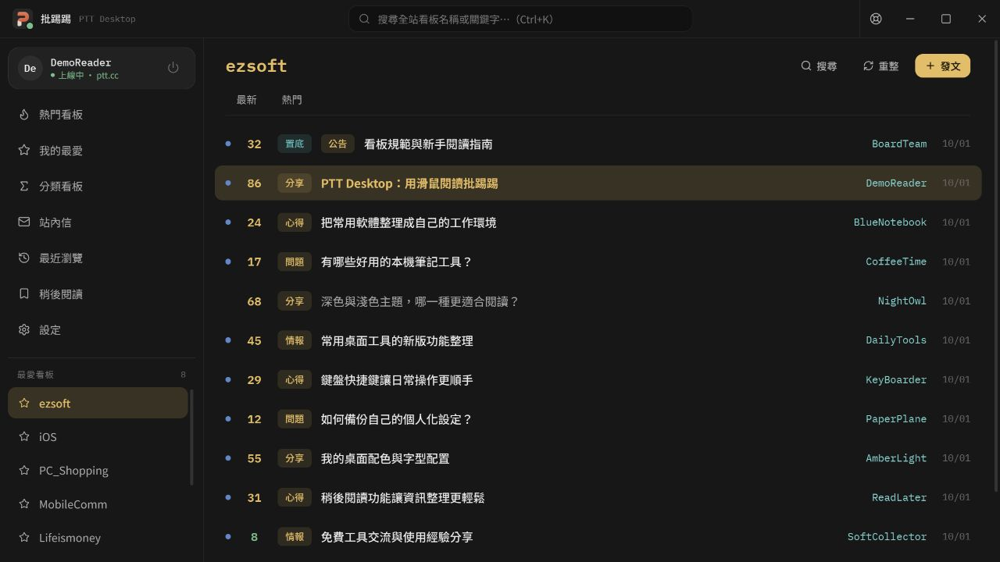
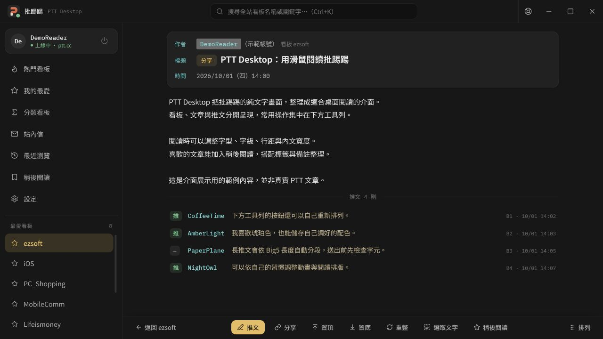
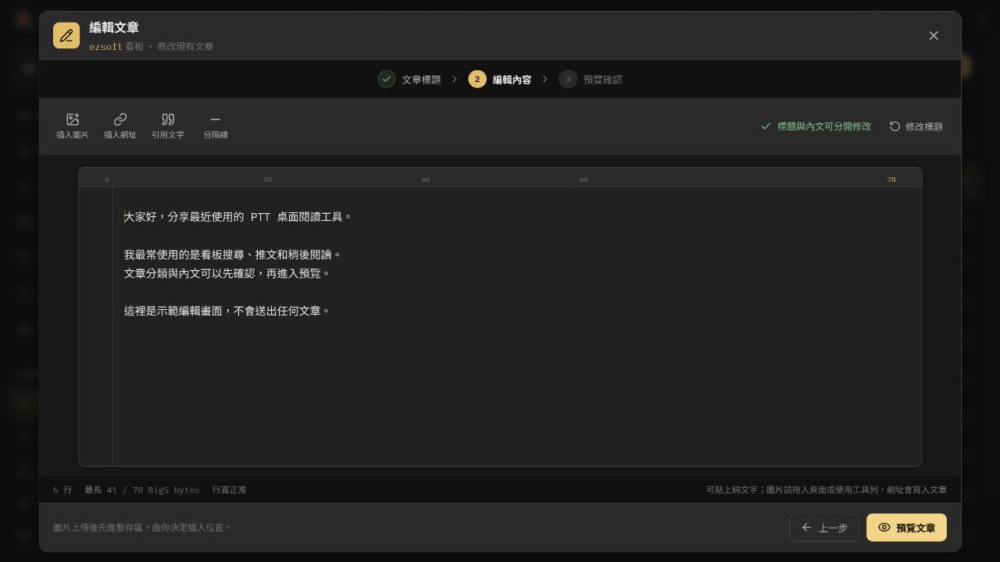
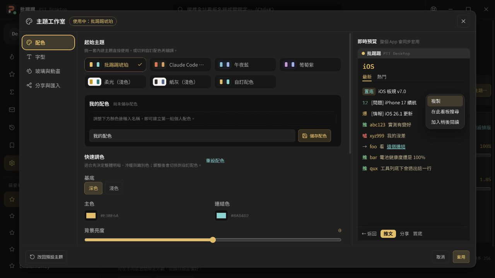
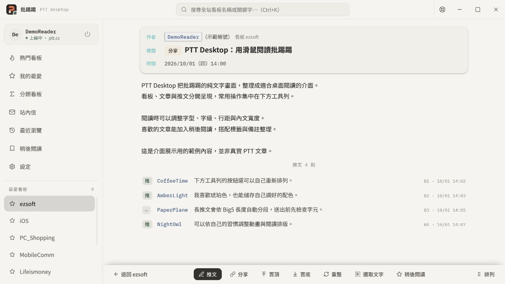
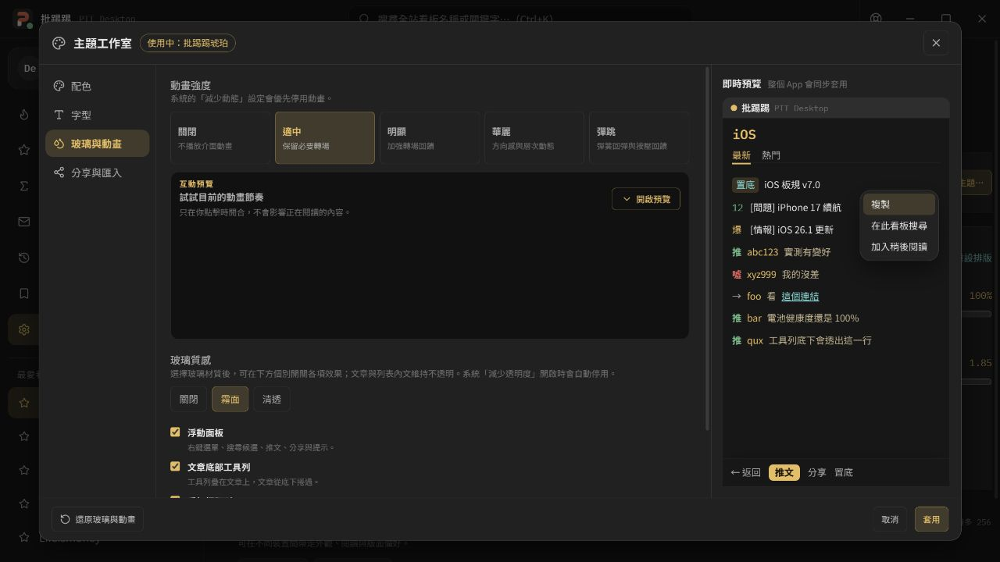

# 批踢踢 — PTT Desktop

把熟悉的 PTT 看板、文章與推文，放進適合滑鼠操作的 Windows 桌面介面。

PTT Desktop 是**非官方批踢踢客戶端**。透過 PTT 的 WebSocket 通道連線，保留看板與推噓文的使用方式，同時提供更清楚的閱讀排版、圖片預覽、桌面編輯器與可自訂的外觀。適合想輕鬆逛板，也希望保留鍵盤操作習慣的使用者。

[下載最新正式版](https://github.com/a3619453-cell/ptt-desktop/releases/latest) · [查看更新紀錄](https://github.com/a3619453-cell/ptt-desktop/releases) · [回報問題](https://github.com/a3619453-cell/ptt-desktop/issues)



> 本頁圖片以 v0.2.2 的實際介面元件製作，帳號、標題、內文及推文皆為示範資料，不是真實 PTT 紀錄。顯示效果會依視窗大小、字型與個人設定不同而有所差異。

## 可以做什麼？

### 找看板、逛文章

- 瀏覽熱門看板、我的最愛，或沿分類目錄逐層尋找看板。
- 在上方搜尋欄輸入板名或關鍵字，從候選看板進入。
- 在看板中依標題或作者搜尋，支援累加搜尋條件與載入更多結果。
- 清楚區分未讀、已讀與有更新的文章；返回列表時保留瀏覽位置。
- 使用看板的右鍵選單加入我的最愛；移除前會要求確認。
- 左側下半部可選擇顯示我的最愛、最近瀏覽、稍後閱讀，或隱藏。

### 閱讀文章、查看推文

- 作者、分類、標題、時間與推文分開呈現，閱讀時不必一直翻終端頁面。
- 支援圖片預覽與點擊放大、YouTube／Imgur 嵌入內容；推文圖片預覽可在設定調整。
- PTT 文章網址與可辨識的文章代碼能在程式內開啟，並保留返回上一頁的閱讀路徑。
- 可搜尋目前文章**已載入**的內文與推文。
- 點作者或使用推文右鍵選單，查詢 PTT 網友資料與名片。
- 長討論串支援分段載入與置底優先讀取；文章停留時可背景檢查新推文。
- 下方功能列提供推文、分享、置頂／置底、重整、選取文字與稍後閱讀；按「排列」可調整按鈕順序。



### 推文、發文與編輯

- 推、噓、箭頭推文皆可操作，長推文依 Big5 長度自動分段。
- 送出前檢查 PTT 不支援的字元，避免內容默默變成錯字或問號。
- 發文與編輯採「標題 → 編輯內容 → 預覽確認」流程，分類範本可補齊必要資訊。
- 提供網址、引用文字、分隔線與圖片工具，並以 Big5 位元組計算行寬。
- 草稿可在本機自動保存與復原。
- 可選用 ImgBB 上傳圖片：先進圖片暫存區，再自行決定插入內文的位置。此功能需要你自己的 ImgBB API key。



### 站內信與本機收藏

- 站內信採對話清單與閱讀窗格，可收信、寫信、回覆與刪除信件。
- 支援新信提示與通知；未讀狀態依 PTT 信件列表標記判定。
- 稍後閱讀會保存本機文章快照，支援搜尋、標籤與備註。
- 本機快照不是即時 PTT 備份，也不會自動同步到其他裝置。

### 自訂成自己喜歡的樣子

- 內建深色與淺色主題，包括琥珀、午夜藍、葡萄紫與紙灰。
- 主題工作室提供快速調色與完整調色，可命名、儲存及切換多組個人配色。
- 可選字型、調整文章／推文字級、行距、內容寬度與看板列表密度。
- 玻璃質感提供關閉、霧面與清透，浮動面板、工具列、標題列及邊緣折射可個別調整。
- 動畫提供「關閉、適中、明顯、華麗、彈跳」五級，**預設為適中**。
- 可分享主題代碼，或匯出／匯入本機設定。設定備份不含帳密、API key、信件、文章快照或 PTT 最愛看板。



<details>
<summary>看看淺色閱讀介面，以及玻璃與動畫設定</summary>

紙灰淺色主題：



動畫強度與玻璃質感由使用者自行選擇，不需要接受固定的效果：



</details>

## 下載與安裝

本公開倉庫目前提供 **Windows x64** 正式成品，以 Windows 11 為主要驗證環境；其他系統版本與硬體組合未逐一驗證。使用線上 PTT 功能需要網路；發文、推文及站內信需要具備相應權限的 PTT 帳號。

介面使用 Microsoft Edge WebView2。若系統缺少 Runtime，請從 [Microsoft 官方 WebView2 頁面](https://developer.microsoft.com/microsoft-edge/webview2/)取得；建議一般使用者優先選安裝版。

前往 [最新 Release](https://github.com/a3619453-cell/ptt-desktop/releases/latest)，展開 **Assets**，依需求選擇：

| 檔案類型 | 適合誰 | 使用方式 |
| --- | --- | --- |
| `…Windows-x64-Setup.exe` | 一般使用者，建議選這個 | 執行安裝程式，之後從捷徑開啟 |
| `…Windows-x64.exe` | 想先試用、不想安裝的人 | 下載到自己的資料夾，直接開啟 |
| `…Windows-x64.msi` | 需要 MSI 部署方式的人 | 使用 Windows Installer 安裝 |

`SHA256.txt` 是檔案校驗資訊；`.sig` 與 `latest.json` 是更新系統使用的檔案，不用自行開啟。GitHub 自動列出的「Source code」是這個發布倉庫的內容，**不是安裝檔，也不包含應用程式原始碼**。

<details>
<summary>想自行核對下載檔案的 SHA-256？</summary>

下載同一個 Release 的 `SHA256.txt`，在下載資料夾開啟 PowerShell，將下方檔名替換成實際下載的檔名：

```powershell
Get-FileHash -LiteralPath '.\PTT-Desktop-v0.2.2-Windows-x64-Setup.exe' -Algorithm SHA256
```

結果應與 `SHA256.txt` 內相同檔名那一列一致。若不一致，請不要執行，重新從本倉庫下載。雜湊一致可確認檔案未在下載過程中改變，但不代表第三方安全認證。

</details>

> 免安裝版只是免除安裝步驟，並非完全自攜式軟體：設定、草稿、閱讀紀錄與記住的帳密仍可能保存在目前 Windows 使用者的本機資料區／認證管理員，不會全部放在 EXE 旁。

## 快速開始與使用方式

1. 下載安裝版或免安裝 EXE，開啟 PTT Desktop。
2. 輸入自己的 PTT 帳號與密碼，或選「以訪客瀏覽」。訪客功能及可讀看板受 PTT 限制。
3. 從熱門看板、我的最愛、分類看板進入，或在頂端搜尋板名。
4. 點文章開始閱讀；下方「推文」可開啟輸入窗，在看板右上方「發文」可建立文章。
5. 到「設定 → 外觀與閱讀排版」調整閱讀習慣；「自訂主題…」會開啟主題工作室。

成功登入後，左側會顯示上線狀態，並能開啟看板文章列表。若卡在連線或某個 PTT 畫面，可從右上角救生圈圖示進入「診斷與救援」。

| 常用操作 | 方式 |
| --- | --- |
| 搜尋看板 | `Ctrl + K` |
| 搜尋目前文章已載入的文字 | `Ctrl + F` |
| 選擇／開啟列表項目 | `↑`、`↓`、`Enter` |
| 返回上一頁 | 滑鼠側鍵、往右拖曳，或焦點不在輸入欄／按鈕時按 `←`、`Backspace` |
| 複製文章文字 | 先按底部「選取文字」，再選取、複製 |
| 調整文章功能列 | 按底部「排列」後拖曳按鈕 |
| 完整快捷鍵說明 | 到設定查看「鍵盤操作說明」 |

## 如何更新？

- 在「設定 → 程式更新」按「檢查更新」，查看版本與更新說明。
- 可開啟「啟動後自動檢查」；**只會檢查版本，不會未經操作就下載或安裝**。
- 安裝版可使用「下載並安裝」。更新包安裝前會驗證 Tauri updater 簽章；請先完成正在進行的發文、編輯或站內信操作。
- 若使用免安裝版且想維持免安裝方式，請關閉程式，再從 Release 下載新的免安裝 EXE 替換。內建更新流程使用安裝程式，不是原地替換免安裝 EXE。
- 更新失敗時也可從本倉庫手動下載；請先閱讀該版的更新說明。

更新簽章用來確認更新包符合發行金鑰，不等於第三方資安認證，也不等同 Windows 的程式碼簽署。請只從本倉庫取得檔案；若來源或系統警告無法確認，不要執行。

## 隱私與安全界線

- **PTT 登入連線**：應用程式透過加密的 `wss://ws.ptt.cc/bbs` 連至 PTT，帳密不經作者架設的登入中繼伺服器。
- **記住帳密**：Windows 正式版使用 Windows 認證管理員保存。這是本機保護，不代表共用電腦或已被入侵的電腦仍能保證安全；在公用電腦上請勿記住帳密或自動登入。
- **本機資料**：草稿、偏好設定、最近瀏覽與稍後閱讀保存在本機，不提供雲端同步。若分享電腦，這些資料也需要自行妥善管理。
- **外部連線**：檢查更新會連至 GitHub；載入網頁字型、圖片、YouTube 或 Imgur 內容會連至各服務。這些服務可能取得一般網路連線資訊，例如 IP 位址，受各自的政策管理。
- **選用服務**：按縮網址會把網址送到 is.gd；使用圖片上傳會把所選圖片與 API key 送到 ImgBB。請勿上傳私密圖片或縮短含敏感參數的網址。
- **診斷報告**：報告設計上不含密碼、API key、文章／信件正文或完整終端畫面，並會遮蔽部分敏感資訊；回報前仍請自行檢查，勿直接分享終端截圖或帳密。

## 已知限制與常見問題

**不是官方客戶端，也不保證每個功能與每篇文章都完美。** 日常看板瀏覽、閱讀與互動是主要使用情境，但 PTT 畫面、站方規則、網路品質或外部圖庫變動，都可能影響功能。重要發文與信件請保留副本，送出後回到 PTT 確認結果。

<details>
<summary>為什麼有些字元不能送出？</summary>

PTT 使用 Big5-UAO，不是完整的 Unicode 系統；部分 emoji、罕見字與其他字元無法表示。程式會在送出前提示問題字元，請替換後再送出。v0.2.2 也修正了部分中文字被對應成其他字的問題。

</details>

<details>
<summary>為什麼熱門長文章或圖片比較慢？</summary>

程式需要從 PTT 終端畫面讀取、整理文章與推文；大量推文可能需要多次翻頁。圖片與影片則由外部網站提供，速度、刪檔、禁止外連等限制不是程式都能控制。搜尋文章文字時，尚未載入的內容不在搜尋範圍內。

</details>

<details>
<summary>連線中斷、讀取失敗或送出結果不確定怎麼辦？</summary>

先檢查網路與 PTT 是否正常，再使用「診斷與救援」重新連線或退出卡住的狀態。若同時在其他裝置登入，也請檢查重複登入提示。

發文、推文、編輯或寄信出現逾時時，**先重整或用其他 PTT 客戶端確認是否已送出，不要連續重按送出**，避免重複發送。請保留尚未確認成功的草稿。

</details>

<details>
<summary>收藏與備份有什麼差別？</summary>

「我的最愛」是 PTT 看板收藏；「稍後閱讀」是本機文章快照；「設定備份」只帶走允許匯出的外觀與操作偏好。匯出設定不會替你備份 PTT 帳號、信件、看板收藏或所有本機文章。

</details>

## 回報問題

歡迎到 [Issues](https://github.com/a3619453-cell/ptt-desktop/issues) 回報。請盡量提供：

- 程式版本、Windows 版本，以及安裝版或免安裝版。
- 如何觸發、預期結果與實際結果；文章問題可提供公開文章網址。
- 經檢查的診斷報告，或已遮蔽個人資訊的截圖。

不要提供密碼、API key、私人站內信、完整終端紀錄或尚未公開的草稿。若你懷疑是可利用的安全漏洞，請先提出不含攻擊細節與敏感資料的聯繫需求，不要在公開 Issue 貼出完整利用方法。

---

本倉庫用於發布正式成品、更新說明與程式內更新資訊，**不公開應用程式原始碼**。PTT Desktop 與 PTT 站方無隸屬或官方授權背書關係；使用時仍須遵守 PTT 與各看板規範。

本頁依 v0.2.2 整理，最後更新：2026-10-01。實際版本與近期變更請以 [Releases](https://github.com/a3619453-cell/ptt-desktop/releases) 為準。
